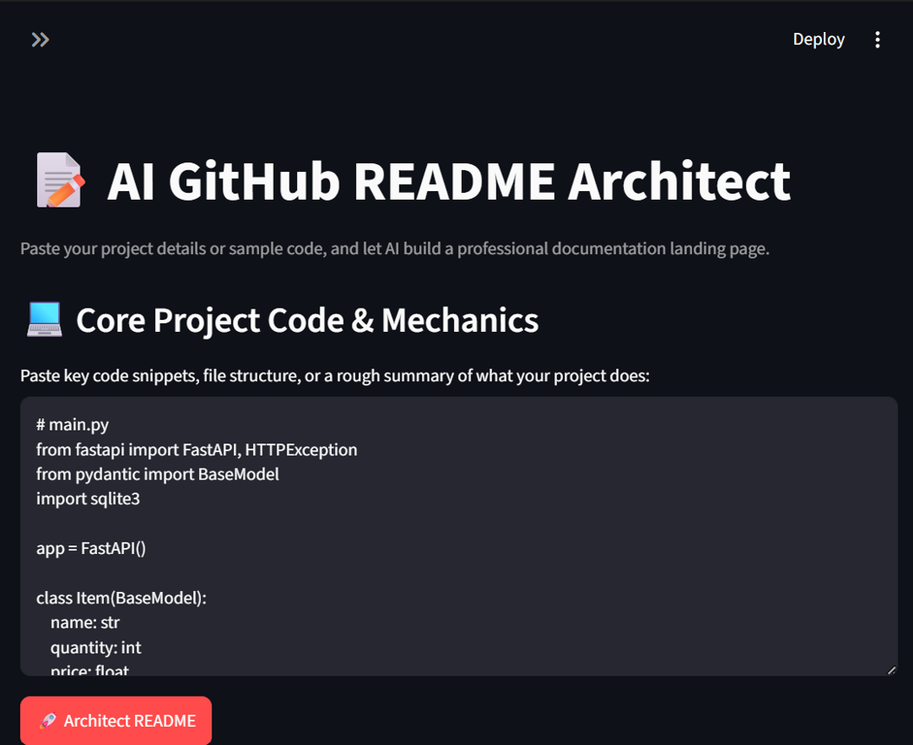

# 📝 AI GitHub README Architect

An automated documentation builder powered by the Gemini 2.5 Flash API and Streamlit. Drop in your raw code or folder snippets, and let AI structure a highly polished, professional markdown overview.

##  Live Demo
https://dhrumitcodes-ai-readme-architect-app-9rqp5d.streamlit.app/

##  Features
- **Instant Architecture:** Analyzes code contexts to auto-generate endpoint guides, features, and setup blocks.
- **Side-by-Side Tabs:** Review a beautifully rendered preview or instantly copy the raw markdown structure.
- **Secure Handling:** Completely isolated environment secrets via environment files.

## 📦 Local Setup & Installation

1. Clone the repository:
   ```bash
   git clone [https://github.com/dhrumitcodes/ai-readme-architect.git](https://github.com/dhrumitcodes/ai-readme-architect.git)
   cd ai-readme-architect

2. Install the necessary system dependencies:
   pip install -r requirements.txt

3. Set up your API credentials in a .env file:
   GEMINI_API_KEY=your_actual_api_key_here

4. Boot up the local client dashboard:
python -m streamlit run app.py

🛠️ Tech Stack:
-Interface Framework: Streamlit
-Intelligence Layer: Google Gemini SDK (gemini-2.5-flash)
-Environment Management: Python-dotenv



### 💡 How to use this for Full-Stack (MERN / Django / Next.js) Apps
Since full-stack projects span multiple files, you don't need to paste thousands of lines of raw UI code. Instead, paste the **architectural backbone** files into the generator text box, separated by simple file headers:

```text
// ================= BACKEND: server.js =================
const express = require('express');
// ... your core routing/middleware logic

// ================= DATABASE: User.js =================
const userSchema = new mongoose.Schema({ ... });

// ================= FRONTEND: api.js =================
import axios from 'axios';
// ... your core API fetch utilities